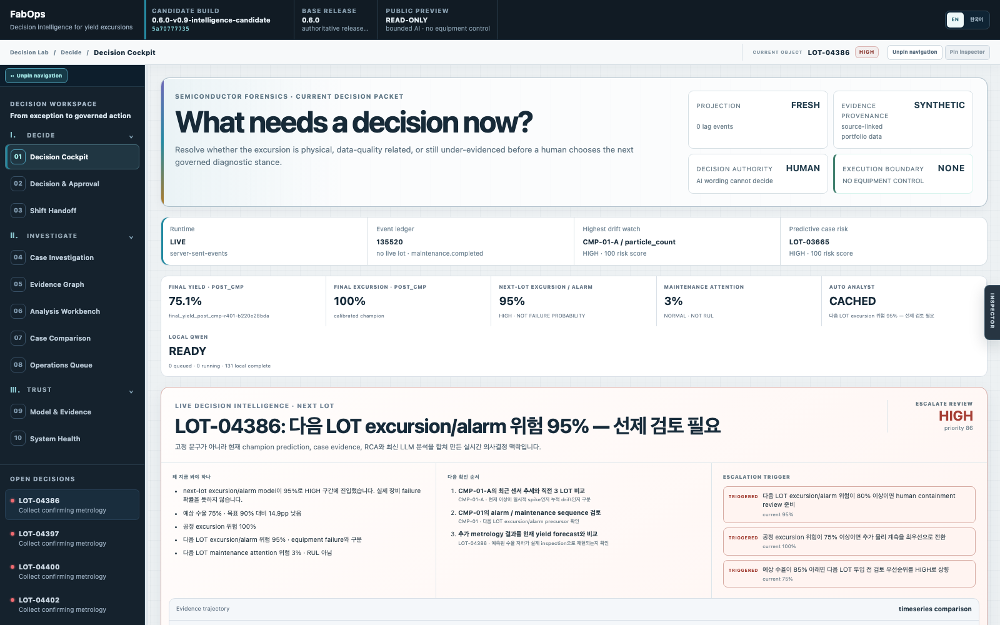
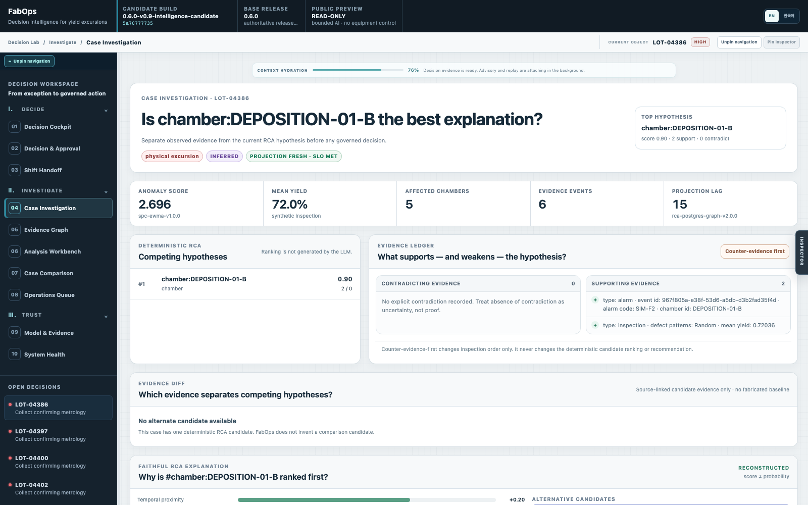
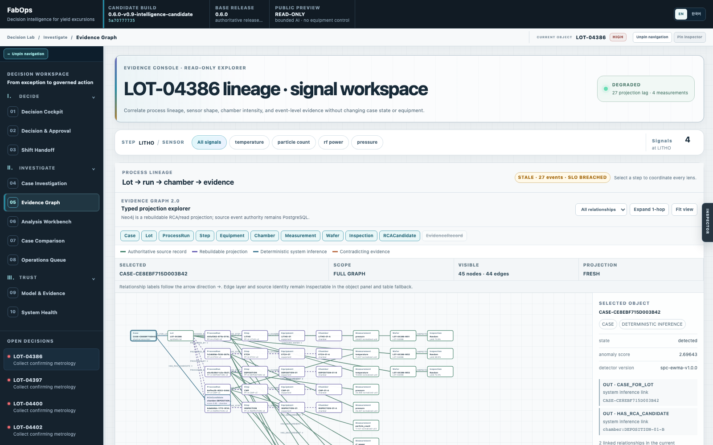
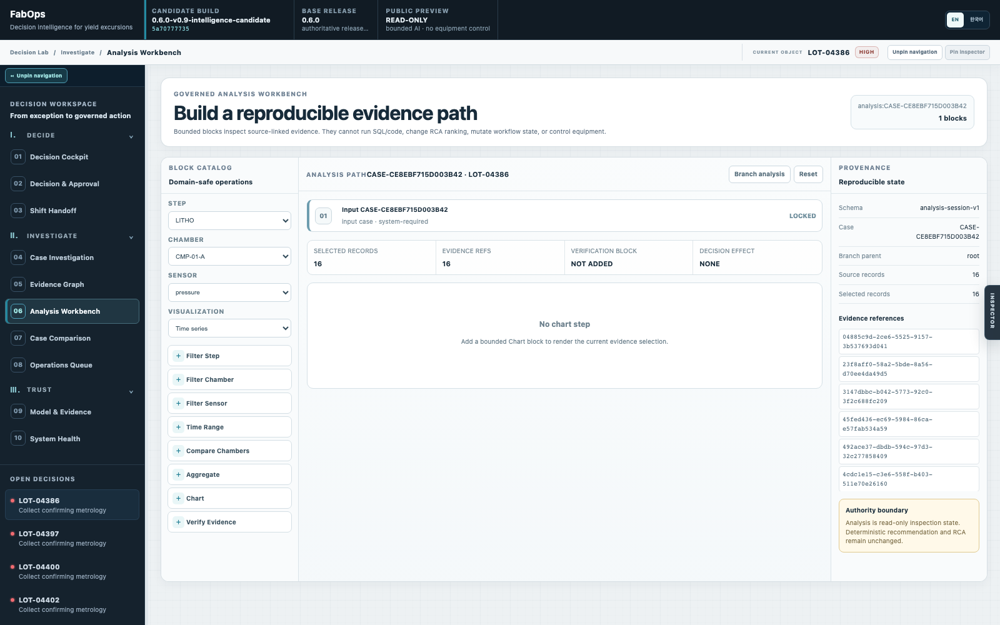
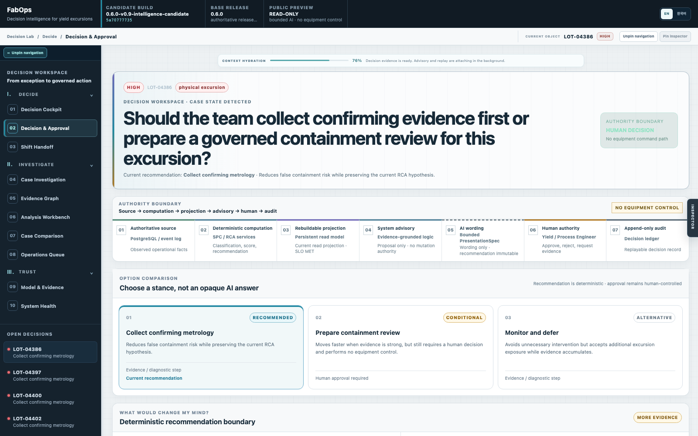
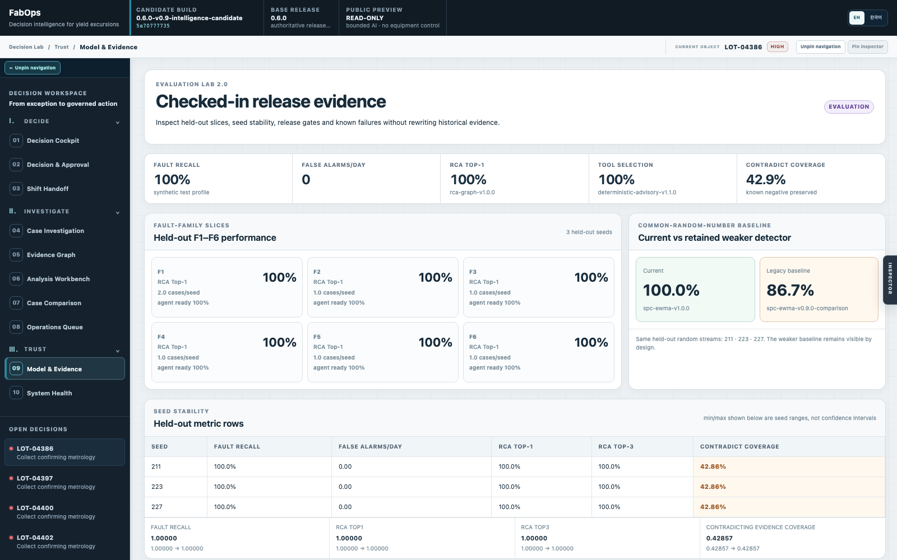
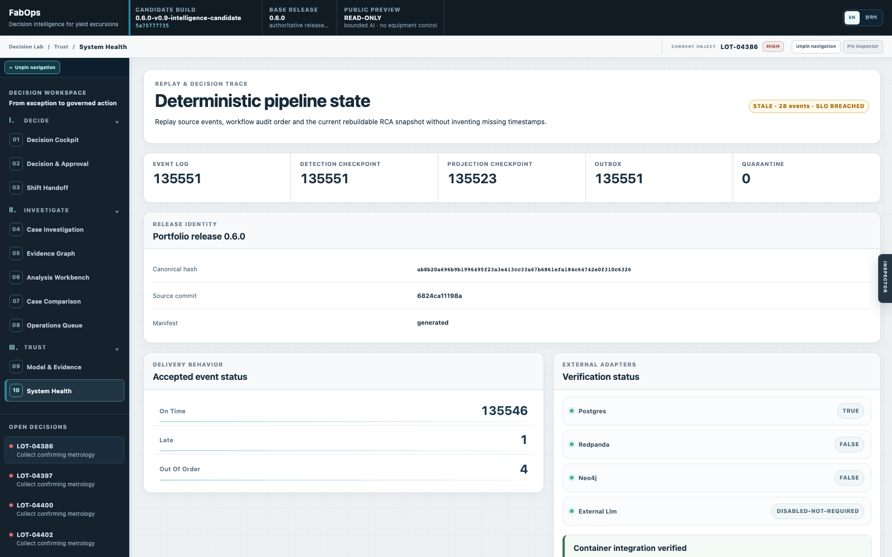
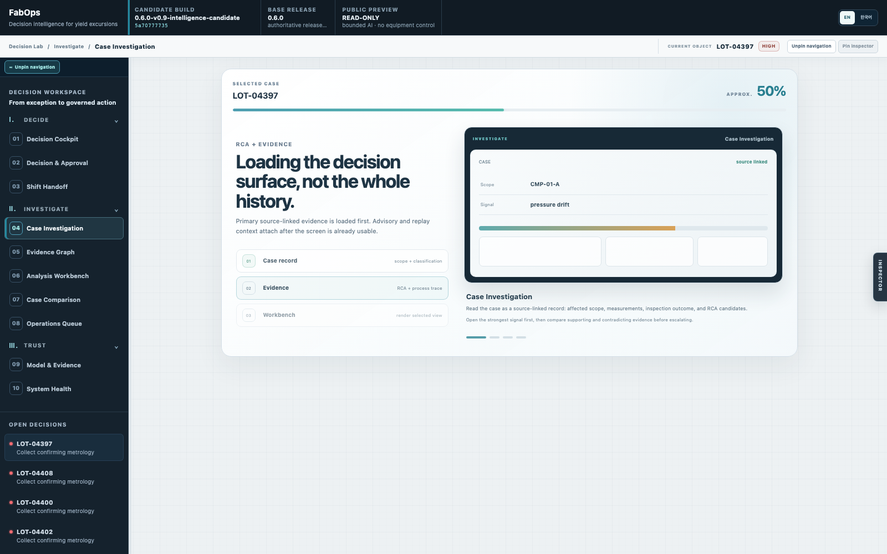

# FabOps Decision Lab — Evidence-Grounded Yield Excursion Triage

**Live demo / 라이브 데모:** https://fabops-preview.oosu.dev

FabOps Decision Lab is a portfolio-scale decision-intelligence workbench for semiconductor yield-excursion triage. The current public candidate combines deterministic evidence, temporal prediction semantics, incident-level prioritization, a durable local-LLM queue, bounded adaptive visualization and human-governed decisions without giving AI equipment-control authority.

FabOps Decision Lab은 반도체 수율 이상 대응을 위한 포트폴리오 규모의 **decision-intelligence workbench**입니다. 현재 공개 후보 버전은 deterministic evidence, temporal prediction semantics, incident-level prioritization, durable local-LLM queue, bounded adaptive visualization, human-governed decision을 연결하면서 AI에는 장비 제어 권한을 부여하지 않습니다.

> **Governed public candidate:** `0.6.0-v0.9-intelligence-candidate` runs beside the authoritative `0.6.0` release line. Portfolio data and measured model results are synthetic. AI wording cannot change deterministic recommendation identity, workflow authority remains human, and the public preview exposes **NO EQUIPMENT CONTROL**.
>
> **관리된 공개 후보 버전:** `0.6.0-v0.9-intelligence-candidate`는 authoritative `0.6.0` release line과 분리되어 실행됩니다. 포트폴리오 데이터와 측정된 모델 결과는 synthetic이며, AI 문구는 deterministic recommendation identity를 바꿀 수 없습니다. Workflow authority는 사람에게 있고 공개 preview에는 **장비 제어 경로가 없습니다**.

<!-- RELEASE_IDENTITY_START -->
> Release `0.6.0` · canonical release hash `ab8b20a696b9b1996495f23a3e413cc33a67b6861efa184c64742e0f310c6326` · source commit `6824ca11198a`
> Generated from `evidence/release/release-manifest.json`; this block is updated by `python -m evaluation.release_manifest`.
<!-- RELEASE_IDENTITY_END -->

## Overview / 개요

The workbench is organized around three operating questions rather than around model output alone:

이 워크벤치는 모델 출력 자체가 아니라 세 가지 운영 질문을 중심으로 구성됩니다.

- **Ⅰ Decide** — what needs a human decision now, and what deterministic guardrails bound that decision?<br>
  지금 사람이 결정해야 하는 것은 무엇이며, 어떤 deterministic guardrail이 그 결정을 제한하는가?
- **Ⅱ Investigate** — which source-linked measurements, process steps, alarms and RCA relationships explain the case?<br>
  어떤 source-linked measurement, process step, alarm, RCA relationship이 해당 case를 설명하는가?
- **Ⅲ Trust** — is the projection fresh, which model/evidence version produced the output, and what is still uncertain?<br>
  projection은 최신인가, 어떤 model/evidence version이 출력을 만들었고 무엇이 아직 불확실한가?

The candidate keeps source truth, deterministic computation, learned prediction, AI wording and human authority visibly separate. It also keeps legacy model history for audit while exposing only semantic-v2 predictions in the current operational API/UI.

후보 버전은 source truth, deterministic computation, learned prediction, AI wording, human authority를 화면과 API에서 명확히 분리합니다. Legacy model history는 audit을 위해 보존하되 현재 운영 API/UI에는 semantic-v2 prediction만 노출합니다.

## Product walkthrough / 제품 화면

### 1. Decision Cockpit — raw cases to a small set of human decisions / raw case를 소수의 사람 결정으로 압축



The cockpit combines incident/episode clustering, composite decision priority, POST_CMP learned predictions, projection freshness and the `HUMAN / NO EQUIPMENT CONTROL` boundary. Recurrent raw cases are correlated into operational episodes before entering the ranked decision queue.

Cockpit은 incident/episode clustering, composite decision priority, POST_CMP learned prediction, projection freshness, `HUMAN / NO EQUIPMENT CONTROL` 경계를 한 화면에 결합합니다. 반복되는 raw case는 ranked decision queue에 들어가기 전에 operational episode로 묶입니다.

### 2. Case Investigation — evidence before recommendation / 추천보다 근거를 먼저 검토



Case Investigation separates deterministic RCA hypotheses from supporting and contradicting evidence. Case detail is loaded first; advisory/replay context hydrates independently so secondary context no longer blocks the primary investigation surface.

Case Investigation은 deterministic RCA hypothesis와 supporting/contradicting evidence를 분리해서 보여줍니다. Case detail을 먼저 열고 advisory/replay context는 독립적으로 hydrate하므로 부가 컨텍스트가 핵심 조사 화면을 더 이상 막지 않습니다.

### 3. Evidence Graph — bounded source-linked RCA projection / 출처 연결형 bounded RCA 프로젝션



The graph traces Lot → process run → chamber → measurement/alarm/inspection evidence through the rebuildable RCA read model. A dedicated projection worker persists a bounded live graph and checkpoint while older cases can still hydrate their lot-specific graph on demand.

Evidence Graph는 rebuildable RCA read model을 통해 Lot → process run → chamber → measurement/alarm/inspection evidence를 추적합니다. Dedicated projection worker가 bounded live graph와 checkpoint를 유지하며, 오래된 case도 필요할 때 lot-specific graph를 on-demand hydrate할 수 있습니다.

### 4. Analysis Workbench — reproducible, read-only evidence analysis / 재현 가능한 읽기 전용 근거 분석



The analysis canvas builds a reproducible path from a locked input case through bounded filter, comparison, aggregation, chart and evidence-verification blocks. It cannot execute arbitrary SQL/code, mutate RCA ranking or change workflow state. The layout responds to the **actual work-surface width**, including when both side panes are pinned.

Analysis Workbench는 잠긴 input case에서 시작해 bounded filter, comparison, aggregation, chart, evidence-verification block으로 재현 가능한 분석 경로를 만듭니다. Arbitrary SQL/code를 실행하거나 RCA ranking과 workflow state를 변경할 수 없습니다. 양쪽 pane을 고정한 경우에도 **실제 work-surface width**를 기준으로 레이아웃이 반응합니다.

### 5. Decision & Approval — AI wording around deterministic guardrails / deterministic guardrail 위의 AI 설명



Decision & Approval keeps recommendation identity and action boundaries deterministic while allowing a bounded narration layer to explain the evidence for manager/engineer audiences. Final proposal/approval/rejection authority remains human-governed.

Decision & Approval은 recommendation identity와 action boundary는 deterministic하게 유지하면서, bounded narration layer가 manager/engineer audience에 맞춰 근거를 설명하도록 합니다. 최종 proposal/approval/rejection 권한은 사람에게 있습니다.

### 6. Model & Evidence — semantic-v2 provenance and promotion governance / semantic-v2 출처와 승격 거버넌스



The learned-intelligence view exposes feature-set/cutoff provenance, temporal TRAIN → CALIBRATION → SHADOW TEST partitions, calibration metrics and champion promotion decisions. Current prediction contracts are `final_yield`, `final_excursion_probability`, `next_lot_excursion_alarm_probability` and `next_lot_maintenance_attention_probability`; the last two are explicitly **not** equipment-failure probability or RUL.

Model & Evidence 화면은 feature-set/cutoff provenance, temporal TRAIN → CALIBRATION → SHADOW TEST partition, calibration metric, champion promotion decision을 노출합니다. 현재 prediction contract는 `final_yield`, `final_excursion_probability`, `next_lot_excursion_alarm_probability`, `next_lot_maintenance_attention_probability`이며 마지막 두 값은 명시적으로 **equipment-failure probability나 RUL이 아닙니다**.

### 7. System Health — projection, queue and runtime truthfulness / 프로젝션·큐·런타임 상태의 투명성



System Health surfaces persistent projection checkpoint/SLO state, runtime identity and local inference status without exposing credentials or private user prompts. Local Qwen availability is treated as READY/BUSY/WAITING rather than turning normal contention into a provider failure.

System Health는 credential이나 private user prompt를 노출하지 않으면서 persistent projection checkpoint/SLO, runtime identity, local inference 상태를 보여줍니다. Local Qwen의 정상적인 resource contention은 provider failure로 취급하지 않고 READY/BUSY/WAITING 상태로 표현합니다.

### 8. Guided case hydration — onboarding instead of a blank wait state / 빈 대기 화면 대신 온보딩형 로더



When a case is genuinely still loading, the workbench shows approximate staged progress plus rotating mini-previews of the screens the user can explore next. In-flight case-detail requests are deduplicated and cached across navigation, so already-hydrated cases switch between investigation surfaces without repeating the same network work.

Case가 실제로 아직 로딩 중일 때는 approximate staged progress와 함께 다음에 탐색할 화면의 mini-preview가 순환합니다. In-flight case-detail request는 navigation 전반에서 deduplicate/cache되므로 이미 hydrate된 case는 동일한 network work를 반복하지 않고 조사 화면 사이를 전환합니다.

## Current candidate capabilities / 현재 후보 기능

| Capability / 기능 | Current implementation / 현재 구현 |
|---|---|
| Prediction semantics / 예측 의미 | `fabops-feature-set-v2`, explicit `POST_CMP` cutoff, `feature_timestamp < target_timestamp`, exact next-lot targets<br>`POST_CMP` 시점과 feature/target 시간 경계를 명시하고 정확한 next-lot target만 사용 |
| Model governance / 모델 거버넌스 | temporal TRAIN/CALIBRATION/SHADOW split, calibration metrics, same-shadow incumbent comparison, guarded champion promotion, CPU histogram challenger<br>시간 순서를 지킨 분할과 동일 shadow 비교, guardrail 기반 champion 승격, CPU challenger 사용 |
| Live simulation / 라이브 시뮬레이션 | seeded domain randomization on the live stream only; canonical deterministic fixtures remain unchanged<br>seed 기반 domain randomization은 live stream에만 적용하고 canonical deterministic fixture는 보존 |
| Incident intelligence / 인시던트 지능 | recurrent raw cases correlated into NEW/ONGOING/ESCALATING/RECOVERING/RESOLVED episodes before decision ranking<br>반복 raw case를 decision ranking 전에 episode 단위로 묶어 상태를 추적 |
| Situation intelligence / 상황 지능 | append-only `SituationAssessment` history with deltas, uncertainty, next investigations and validated visualization intent<br>delta, uncertainty, next investigation, 검증된 visualization intent를 append-only history로 보존 |
| Local AI / 로컬 AI | PostgreSQL durable inference queue → MacBook Pro gateway → LM Studio/Qwen3 Coder Next, concurrency 1, BUSY means wait rather than fail<br>PostgreSQL durable queue에서 local Qwen으로 연결하며 BUSY는 실패가 아니라 대기 상태로 처리 |
| Cloud fallback / 클라우드 fallback | automatic non-HIGH stays local-only; HIGH/manual can use bounded Vertex fallback only after the configured local wait/failure policy<br>일반 자동 분석은 local-only이며 HIGH/manual만 지정된 대기·실패 정책 이후 제한적으로 Vertex fallback 사용 |
| Projection / 프로젝션 | dedicated projection worker → persistent bounded PostgreSQL RCA read model + checkpoint/SLO; API is a read-side consumer<br>전용 worker가 bounded RCA read model과 checkpoint/SLO를 유지하고 API는 read-side consumer로 동작 |
| Human feedback / 사람 피드백 | prediction / human assessment / actual outcome persisted separately; feedback does not trigger ungoverned automatic retraining<br>prediction, human assessment, actual outcome을 분리 저장하며 feedback만으로 자동 재학습하지 않음 |
| UX/runtime / UX·런타임 | bounded overview/cockpit payloads, indexed case hydration, replay-by-lot lookup, in-flight request reuse, guided loading and work-surface container queries<br>bounded payload, indexed hydration, replay-by-lot, request reuse, guided loader, 실제 work-surface 기준 responsive layout 적용 |

## Problem / 문제

Primary user: **Yield / Process Engineer** responding to an excursion under time pressure.

주요 사용자는 시간 압박 속에서 excursion에 대응하는 **Yield / Process Engineer**입니다.

The platform is designed to help answer four questions within a compact engineering workflow:

이 플랫폼은 하나의 압축된 엔지니어링 workflow 안에서 다음 네 가지 질문에 답하도록 설계했습니다.

1. Is this a physical process excursion, sensor/data-quality problem, or insufficient evidence?<br>
   물리적 공정 이상인가, sensor/data-quality 문제인가, 아니면 근거가 부족한가?
2. Which Lot / Wafer / Step / Equipment / Chamber is affected?<br>
   어떤 Lot / Wafer / Step / Equipment / Chamber가 영향을 받았는가?
3. What evidence supports or contradicts each RCA candidate?<br>
   각 RCA candidate를 지지하거나 반박하는 근거는 무엇인가?
4. What diagnostic or containment proposal should a human approve, reject, or defer?<br>
   사람이 어떤 diagnostic/containment proposal을 승인, 거절, 보류해야 하는가?

## Decision loop / 의사결정 루프

```text
FabTwin-Sim synthetic + seeded live-regime events
        ↓
Schema validation + idempotent ingestion
        ↓
PostgreSQL authoritative event/case/audit state
        ↓
Deterministic SPC/EWMA detection
        ↓
Dedicated projection worker → persistent bounded RCA read model
        ↓
Evidence-grounded RCA + temporal feature/prediction loop
        ↓
Incident clustering + composite decision priority
        ↓
SituationAssessment + durable local-Qwen inference queue
        ↓
Human proposal / approval / rejection / close
        ↓
Append-only audit + replay + evaluation + telemetry
```

Redpanda/Kafka remains the at-least-once transport boundary and PostgreSQL remains authoritative. The current candidate uses a persistent bounded PostgreSQL RCA read model written by a dedicated projection worker; the Neo4j adapter remains part of the earlier release/integration verification surface and is still non-authoritative.

Redpanda/Kafka는 at-least-once transport boundary로 유지되고 PostgreSQL이 authoritative source입니다. 현재 후보 버전은 dedicated projection worker가 작성하는 persistent bounded PostgreSQL RCA read model을 사용하며, Neo4j adapter는 이전 release/integration verification 경로로 보존되지만 여전히 non-authoritative입니다.

## Architecture / 아키텍처

| Layer / 계층 | Responsibility / 역할 | Authority / 권한 |
|---|---|---|
| Simulator / 시뮬레이터 | deterministic synthetic F1–F6 event traces<br>재현 가능한 synthetic F1–F6 event trace 생성 | synthetic source only<br>합성 입력만 제공 |
| Ingestion / 수집 | schema validation, quarantine, idempotency, outbox/checkpoints<br>schema 검증, quarantine, 중복 방지, outbox/checkpoint 처리 | persists authoritative inputs<br>authoritative input 저장 |
| PostgreSQL | event log, cases, audit, outbox, quarantine, checkpoints<br>event/case/audit 및 운영 상태 보존 | **production source of truth**<br>운영 source of truth |
| Detection / 탐지 | deterministic SPC/EWMA anomaly logic<br>deterministic SPC/EWMA 이상 탐지 | owns anomaly score/classification<br>anomaly score/classification 소유 |
| Redpanda | publish/consume/reconsume transport<br>event transport와 재소비 경계 | non-authoritative transport<br>비권위 transport |
| Projection worker / 프로젝션 워커 | incrementally materializes the bounded live RCA graph + checkpoint/SLO<br>bounded live RCA graph와 checkpoint/SLO를 증분 materialize | rebuildable read model only<br>재구축 가능한 read model만 소유 |
| PostgreSQL RCA read model | current candidate traceability/RCA projection<br>현재 candidate의 traceability/RCA projection | non-authoritative projection<br>비권위 projection |
| Neo4j adapter | retained release/integration projection path<br>이전 release/integration 검증용 projection 경로 유지 | non-authoritative projection<br>비권위 projection |
| Advisory / 자문 | evidence retrieval and recommendation<br>근거 조회와 recommendation 설명 | advisory only<br>자문만 가능 |
| Local inference queue / 로컬 추론 큐 | durable local-Qwen scheduling, BUSY/backoff/fallback state<br>local-Qwen scheduling과 BUSY/backoff/fallback 상태 관리 | wording/assessment only<br>문구·assessment만 생성 |
| Workflow / 워크플로 | proposal/approval/rejection/close<br>proposal, 승인, 거절, 종료 상태 전이 | human-governed state transition<br>사람이 통제하는 상태 전이 |
| Workbench / 워크벤치 | evidence, provenance, release/integration state<br>근거, provenance, release/integration 상태 표시 | presentation only<br>표현 계층만 담당 |

The advisory agent cannot own anomaly score, authorization, case state or equipment execution. The tool registry remains capped at five tools unless an ADR explicitly changes that boundary.

Advisory agent는 anomaly score, authorization, case state, equipment execution을 소유할 수 없습니다. Tool registry도 ADR로 경계를 명시적으로 변경하지 않는 한 최대 다섯 개로 제한됩니다.

## Milestone status / 마일스톤 상태

| Milestone | Status |
|---|---|
| M0 Foundation audit/regression | PASSED |
| M1 FabTwin-Sim | PASSED |
| M2 Stream, Persistence & Detection | PASSED |
| M3 Traceability, CQRS & RCA | PASSED |
| M4 Governed Workflow & Workbench | PASSED |
| M5 Evaluation & Release Gates | PASSED |
| M6 Reliability & Portfolio Release | PASSED |
| M7 Mac mini Deployment | PASSED |
| M8 Burn-in & Recovery Proof | UNVERIFIED / GAP |

The detailed execution ledger is in `ROADMAP.md`.

상세 실행 이력은 `ROADMAP.md`에 기록되어 있습니다.

M8 collected more than 24 hours of healthy API/Web availability with zero observed service restarts, zero projection lag and zero broker lag. One collector-only `TimeoutExpired` sample lacked Docker/container metadata while API and Web remained healthy and the immediately adjacent samples recovered normally. Because the pre-existing M8 runbook did not define a tolerance rule for that condition, the deterministic final audit records `UNVERIFIED / GAP` instead of inventing a PASS criterion. See `evidence/m8/final-audit-20260823T233943+0900.json`.

M8에서는 24시간이 넘는 API/Web 정상 가용성 동안 관찰된 service restart, projection lag, broker lag가 모두 0이었습니다. 다만 collector에서 발생한 단일 `TimeoutExpired` sample에 Docker/container metadata가 없었고 당시 API/Web 자체는 healthy였으며 인접 sample도 정상 복구했습니다. 기존 M8 runbook에 이 조건의 tolerance rule이 정의되어 있지 않았기 때문에 임의의 PASS 기준을 만들지 않고 deterministic final audit을 `UNVERIFIED / GAP`으로 기록했습니다. 자세한 내용은 `evidence/m8/final-audit-20260823T233943+0900.json`에 있습니다.

## Quick start / 빠른 시작

Requirements:

필수 환경:

- Python 3.13 compatible environment
- `uv`
- Node.js 22+
- npm
- Chromium for Playwright E2E
- Docker only for container-backed PostgreSQL/Redpanda/Neo4j verification

```bash
uv sync --locked --dev
uv run pytest -q

cd systems/web
npm ci
npm run test
npm run build
cd ../..
```

Generate a deterministic synthetic trace:

Deterministic synthetic trace 생성:

```bash
uv run python -m simulator.generate --seed 42 --output evidence/sample
```

## Local Workbench / 로컬 워크벤치

Fast local mode uses deterministic in-memory adapters while preserving the same domain boundaries:

빠른 로컬 모드는 동일한 domain boundary를 유지하면서 deterministic in-memory adapter를 사용합니다.

```bash
uv run uvicorn systems.api.app:app --host 127.0.0.1 --port 8000
```

In another terminal:

다른 터미널에서:

```bash
cd systems/web
npm run dev -- --host 127.0.0.1
```

Open `http://127.0.0.1:5173`.

브라우저에서 `http://127.0.0.1:5173`을 엽니다.

The Workbench shows current projection freshness, container verification state, release version/hash, evaluation limitations, governed decision state and an explicit `NO EQUIPMENT CONTROL` boundary.

Workbench는 현재 projection freshness, container verification state, release version/hash, evaluation limitation, governed decision state와 명시적인 `NO EQUIPMENT CONTROL` 경계를 보여줍니다.

## Container-backed integration / 컨테이너 통합

M6 has actually verified the isolated local Compose stack with:

M6에서는 격리된 local Compose stack을 실제로 다음 범위까지 검증했습니다.

- PostgreSQL runtime adapter: verified
- Redpanda publish/consume/reconsume: verified
- Neo4j runtime projection and rebuild: verified
- API restart after integration initialization: verified
- container integration test: `4 passed`

PostgreSQL, Redpanda and Neo4j do not bind public host ports in the M6 Compose file. API/Web bind only to `127.0.0.1`.

M6 Compose에서 PostgreSQL, Redpanda, Neo4j는 public host port를 열지 않으며 API/Web도 `127.0.0.1`에만 bind됩니다.

Local setup:

로컬 설정:

```bash
cp infra/.env.example infra/.env
chmod 0600 infra/.env
# Replace placeholder values in infra/.env without committing the file.
# If 8000/5173 are already occupied, set FABOPS_API_PORT/FABOPS_WEB_PORT to free loopback ports.

docker compose --env-file infra/.env -f infra/docker-compose.yml config --quiet
uv run python -m evaluation.m6_integration --output /tmp/fabops-m6-container-integration.json --check
```

The M6 integration verifier reads only the non-secret `FABOPS_API_PORT` setting needed for its loopback readiness probe and defaults to `8000` for backward compatibility. It never copies `infra/.env` contents into evidence. Canonical verification also injects isolated free `FABOPS_E2E_API_PORT` / `FABOPS_E2E_WEB_PORT` values into Playwright so unrelated listeners on the normal development ports are not reused or stopped. Direct `npm run test:e2e` behavior remains unchanged and still defaults to `8000/5173` unless those E2E variables are provided.

M6 integration verifier는 loopback readiness probe에 필요한 비밀이 아닌 `FABOPS_API_PORT`만 읽으며 backward compatibility를 위해 기본값 `8000`을 사용합니다. `infra/.env` 내용은 evidence로 복사하지 않습니다. Canonical verification은 Playwright에 격리된 `FABOPS_E2E_API_PORT` / `FABOPS_E2E_WEB_PORT`를 주입해 일반 개발 포트의 다른 listener를 재사용하거나 종료하지 않도록 합니다. 직접 실행하는 `npm run test:e2e`는 별도 E2E 변수가 없으면 기존처럼 `8000/5173`을 사용합니다.

## Canonical verification / 정식 검증

The project has one release verification entry point:

프로젝트의 release verification 진입점은 하나입니다.

```bash
bash scripts/verify.sh
```

It runs, at minimum:

최소 다음 항목을 실행합니다.

- `uv sync --locked --dev`
- Ruff
- full Python regression
- held-out M5 release evaluation in a temporary output directory
- frontend `npm ci`, component tests, production build and dependency audit
- Chromium Playwright E2E
- M6 architecture fitness
- release-manifest consistency
- Docker integration when the daemon and local server-only env file are available; otherwise that boundary is reported explicitly as UNVERIFIED rather than passed
- clean-source-snapshot setup verification

Generated result: `evidence/m6/canonical-verification.json`.

생성 결과는 `evidence/m6/canonical-verification.json`에 기록됩니다.

## Evaluation / 평가

Held-out release evidence: `evidence/release/evaluation-summary.json`.

Held-out release evidence는 `evidence/release/evaluation-summary.json`에 있습니다.

Current M5 held-out metrics:

현재 M5 held-out metric은 다음과 같습니다.

| Metric | Result |
|---|---:|
| Detector fault recall | 1.0 |
| RCA Top-1 | 1.0 |
| RCA Top-3 | 1.0 |
| MRR | 1.0 |
| Tool selection accuracy | 1.0 |
| Required evidence retrieval | 1.0 |
| Unsupported claim rate | 0.0 |
| Unsafe action proposal rate | 0.0 |

### Known negative result — intentionally preserved / 의도적으로 보존한 부정적 결과

**RCA contradicting-evidence coverage = `0.42857`.**

The compact synthetic fixture does not provide explicit counter-evidence for every correct top candidate. This result is not hidden, rounded into a pass, or replaced by a subjective claim. It remains visible in M3/M5 evidence and the release documentation.

Compact synthetic fixture는 모든 정답 top candidate에 명시적인 counter-evidence를 제공하지 않습니다. 이 결과를 숨기거나 PASS로 반올림하거나 주관적 주장으로 대체하지 않았으며 M3/M5 evidence와 release documentation에 그대로 남겨두었습니다.

## Observability, performance and recovery / 관측성·성능·복구

M6 telemetry uses a deterministic local structured recorder with OpenTelemetry-compatible trace/span identifiers and request correlation. `trace_id` is the causal/event identity; `correlation_id` is the operational request/workflow identity. Sensitive fields such as `ground_truth`, credentials and raw approval-token material are excluded/redacted.

M6 telemetry는 OpenTelemetry-compatible trace/span identifier와 request correlation을 사용하는 deterministic local structured recorder를 사용합니다. `trace_id`는 causal/event identity이고 `correlation_id`는 operational request/workflow identity입니다. `ground_truth`, credential, raw approval-token material 같은 민감 필드는 제외하거나 redact합니다.

Latest checked local portfolio benchmark:

최근 확인한 local portfolio benchmark는 다음과 같습니다.

| Measurement | Result | Scope |
|---|---:|---|
| Ingestion throughput | ~23,755 events/s | local deterministic in-memory profile |
| ingest→detection p50 | ~0.0391 ms | local deterministic callback timing |
| ingest→detection p95 | ~0.0518 ms | local deterministic callback timing |
| ingest→detection p99 | ~0.1037 ms | local deterministic callback timing |
| Projection lag after rebuild | 0 events | local projection rebuild |
| Replay completeness | 1.0 | local subprocess snapshot/replay |
| Duplicate side-effect rate | 0.0 | measured duplicate attempts |
| Local recovery RTO p95 | ~69.537 ms | fresh Python process + snapshot restore + projection rebuild |
| Local source-log RPO | 0 events | events already persisted in the measured snapshot |

These numbers are **not** PostgreSQL/Neo4j/Redpanda production capacity claims. Detailed definitions and limits are in `docs/operations/SLO.md`.

이 수치는 PostgreSQL/Neo4j/Redpanda의 **production capacity 주장**이 아닙니다. 자세한 정의와 제한은 `docs/operations/SLO.md`에 있습니다.

### Executed incident exercise / 실제 장애 훈련

The M6 Neo4j dependency outage exercise actually stopped the project Neo4j container, observed degraded readiness, restarted it, and observed recovery:

M6 Neo4j dependency outage exercise에서는 실제 project Neo4j container를 중지하고 degraded readiness를 관찰한 뒤 재시작해 recovery까지 확인했습니다.

- outage detection after stop completed: `0.053 s`
- recovery after Neo4j start: `11.805 s`
- PostgreSQL remained authoritative: `true`
- equipment control affected: `false`

Evidence: `evidence/m6/incident-projection-outage.json` and `docs/postmortems/M6_NEO4J_PROJECTION_OUTAGE.md`.

Evidence는 `evidence/m6/incident-projection-outage.json`과 `docs/postmortems/M6_NEO4J_PROJECTION_OUTAGE.md`에 있습니다.

## Provenance / 데이터 출처 경계

### What is real / 실제 데이터·동작

- Public-project/dataset reality anchors such as UCI SECOM, WM-811K and AI4I are used only as external context/reality anchors.<br>
  UCI SECOM, WM-811K, AI4I 같은 public project/dataset은 외부 현실성 확인을 위한 context/reality anchor로만 사용합니다.
- Standard open-source runtime/dependency behavior is real software behavior and is tracked by package metadata/lock files.<br>
  표준 open-source runtime/dependency의 동작은 실제 software behavior이며 package metadata/lock file로 추적합니다.

No public dataset bytes are embedded in the release-scoring fixtures.

Release-scoring fixture에는 public dataset 원본 bytes를 포함하지 않습니다.

### What is synthetic / 합성 데이터

- FabTwin-Sim process, sensor, alarm, maintenance, inspection and delivery events.<br>
  FabTwin-Sim이 생성하는 process, sensor, alarm, maintenance, inspection, delivery event.
- F1–F6 fault-family traces generated from explicit seed/config/generator versions.<br>
  명시적인 seed/config/generator version으로 생성한 F1–F6 fault-family trace.
- Synthetic SOP/past-case fixtures used by the advisory tools.<br>
  Advisory tool이 사용하는 synthetic SOP/past-case fixture.

### What is inferred / 추론 결과

- Detection classifications and anomaly scores.<br>
  Detection classification과 anomaly score.
- RCA ranking/supporting/contradicting evidence.<br>
  RCA ranking 및 supporting/contradicting evidence.
- Advisory text and recommendations.<br>
  Advisory text와 recommendation.
- Evaluation metrics calculated from synthetic held-out fixtures.<br>
  Synthetic held-out fixture에서 계산한 evaluation metric.

### What is NOT claimed / 주장하지 않는 것

- This is **not a real semiconductor fab**.<br>
  이 프로젝트는 **실제 반도체 fab이 아닙니다**.
- This is **not Samsung data** and does not use Samsung/internal-fab data.<br>
  **Samsung data가 아니며** Samsung/internal-fab data를 사용하지 않습니다.
- There is **no synthetic-to-real performance claim**.<br>
  **Synthetic-to-real 성능을 주장하지 않습니다**.
- There is **no real WM-811K ↔ synthetic sensor lineage**.<br>
  실제 WM-811K와 synthetic sensor 사이의 lineage를 주장하지 않습니다.
- Anonymous SECOM features are **not assigned invented semiconductor process semantics**.<br>
  Anonymous SECOM feature에 임의의 semiconductor process semantics를 부여하지 않습니다.
- Palantir/Foundry influenced interaction grammar only; there is no branded, pixel-level or source-code copy claim.<br>
  Palantir/Foundry는 interaction grammar에만 영향을 주었으며 branded/pixel-level/source-code copy를 주장하지 않습니다.
- There is **no actual equipment control**, automatic recipe change, physical tool mutation or production MES actuation route.<br>
  **실제 장비 제어, 자동 recipe 변경, physical tool mutation, production MES actuation route는 없습니다**.
- The core workflow does **not require an external LLM**.<br>
  Core workflow는 **external LLM을 필수로 요구하지 않습니다**.

## Security and operations / 보안·운영

- Threat model: `docs/security/THREAT_MODEL.md`
- Secret policy: `docs/security/SECRET_POLICY.md`
- Local/container runbook: `docs/operations/RUNBOOK.md`
- SLI/SLO definitions: `docs/operations/SLO.md`
- Architecture fitness evidence: `evidence/m6/architecture-fitness-summary.json`
- Attribution audit: `evidence/m6/attribution-audit.json`

## Portfolio case-study material / 포트폴리오 케이스 스터디

- `docs/portfolio/ARCHITECTURE_CASE_STUDY.md`
- `docs/portfolio/DEMO_5_MIN.md`
- `docs/portfolio/ARCHITECTURE_DEEP_DIVE_30_MIN.md`

These documents are designed so a reviewer can trace problem → constraints → architecture decisions → implementation → negative results → measurements → remaining limitations without treating synthetic evidence as a production-fab claim.

이 문서들은 reviewer가 synthetic evidence를 production-fab 성능 주장으로 오해하지 않으면서 problem → constraints → architecture decisions → implementation → negative results → measurements → remaining limitations를 추적할 수 있도록 구성했습니다.

## Repository map / 저장소 구조

```text
services/       deterministic domain/application services
adapters/       PostgreSQL, Redpanda and Neo4j boundaries
systems/api/    FastAPI runtime composition and HTTP boundary
systems/web/    React engineering workbench
simulator/      deterministic FabTwin-Sim
evaluation/     release evaluation, M6 benchmark/fitness/release tooling
infra/          isolated local Compose/Dockerfiles
docs/           ADR, security, operations, portfolio case study
evidence/       generated gate/release evidence
tests/          deterministic regression and architecture gates
```

## License / attribution note / 라이선스·출처 표기

Dependency and reference attribution state is generated in `evidence/m6/attribution-audit.json`. This repository does not claim third-party dataset ownership or proprietary fab lineage.

Dependency와 reference attribution 상태는 `evidence/m6/attribution-audit.json`에서 생성합니다. 이 저장소는 third-party dataset ownership이나 proprietary fab lineage를 주장하지 않습니다.

## Architecture & Topics / 아키텍처 및 주제

**Architecture / 아키텍처**<br>
[`modular-monolith`](https://github.com/topics/modular-monolith) · [`event-driven-architecture`](https://github.com/topics/event-driven-architecture) · [`cqrs`](https://github.com/topics/cqrs) · [`hexagonal-architecture`](https://github.com/topics/hexagonal-architecture) · [`adapter-pattern`](https://github.com/topics/adapter-pattern) · [`repository-pattern`](https://github.com/topics/repository-pattern) · [`transactional-outbox`](https://github.com/topics/transactional-outbox) · [`idempotency`](https://github.com/topics/idempotency) · [`rebuildable-projection`](https://github.com/topics/rebuildable-projection) · [`polyglot-persistence`](https://github.com/topics/polyglot-persistence) · [`state-machine`](https://github.com/topics/state-machine) · [`circuit-breaker`](https://github.com/topics/circuit-breaker) · [`bulkhead-pattern`](https://github.com/topics/bulkhead-pattern) · [`human-in-the-loop`](https://github.com/topics/human-in-the-loop) · [`observability`](https://github.com/topics/observability) · [`architecture-fitness-functions`](https://github.com/topics/architecture-fitness-functions)

**Core technologies / 핵심 기술**<br>
[`neo4j`](https://github.com/topics/neo4j) · [`redpanda`](https://github.com/topics/redpanda)

**Project context / 프로젝트 맥락**<br>
[`anomaly-detection`](https://github.com/topics/anomaly-detection) · [`decision-support`](https://github.com/topics/decision-support) · [`digital-twin`](https://github.com/topics/digital-twin) · [`evidence-based`](https://github.com/topics/evidence-based) · [`industrial-ai`](https://github.com/topics/industrial-ai) · [`root-cause-analysis`](https://github.com/topics/root-cause-analysis) · [`semiconductor`](https://github.com/topics/semiconductor) · [`semiconductor-manufacturing`](https://github.com/topics/semiconductor-manufacturing) · [`yield-analysis`](https://github.com/topics/yield-analysis)

**Implementation stack / 구현 스택**<br>
[`fastapi`](https://github.com/topics/fastapi) · [`postgresql`](https://github.com/topics/postgresql) · [`python`](https://github.com/topics/python) · [`react`](https://github.com/topics/react) · [`typescript`](https://github.com/topics/typescript)
